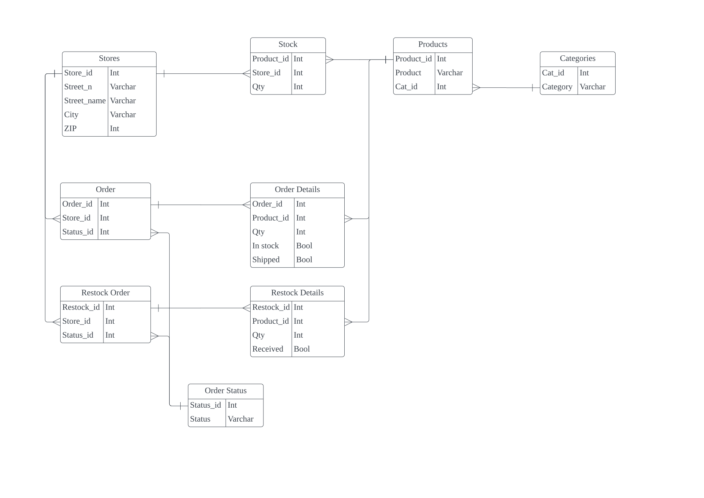
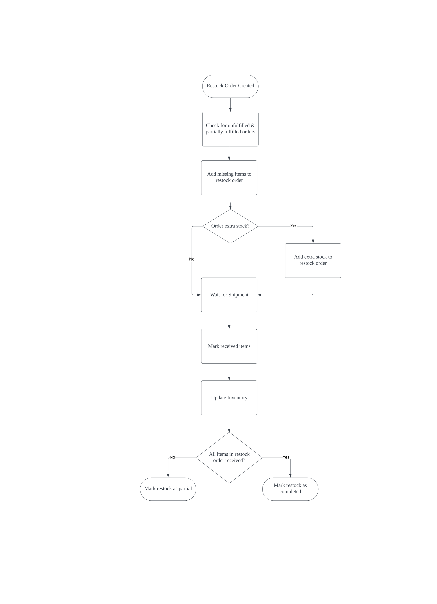
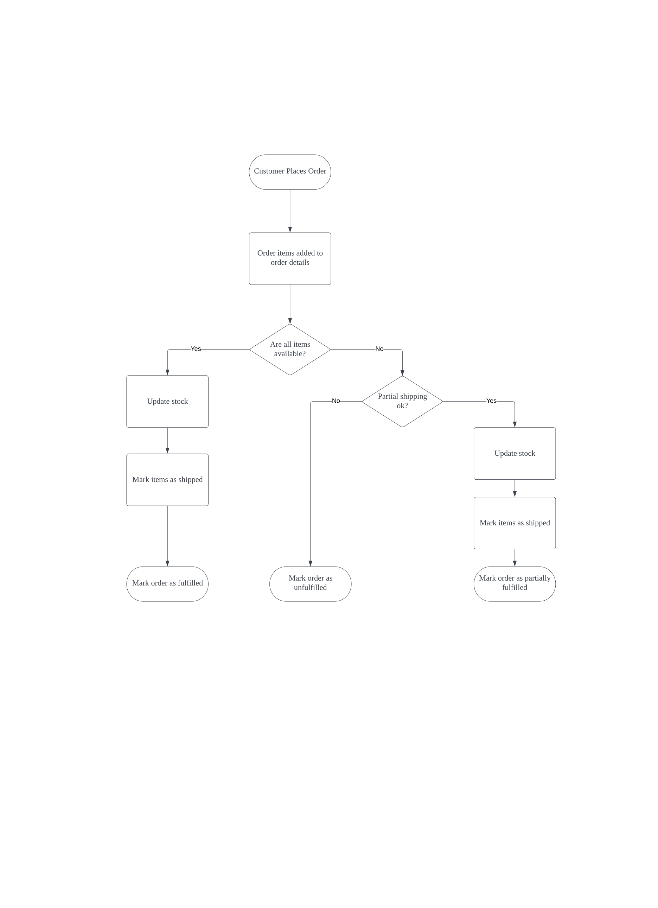

# Inventory Manager
The project was originally a university assignment requiring a set of functions keeping track of a store's inventory as orders are placed and restocks received. 

Wanted to take a hand at rewriting the code to test how I would approach the same task several years down the line.

## Diagrams
___

    
ERD

    

    
Flowcharts

    <ul>
        <li>

Restock

</li>
        <li>

Order

</li>
    </ul>

## TO DOs:
___
- ### Goal 0: implement ERD/flowchart
    - ~~ Update Tables Schema ~~
    - ~~ Separate scripts for recording categories/products/stores & placing orders ~~
        - ~~ Record example setup from csv ~~
    - Update classes -> TO TEST
    - Create Customer class -> TO EXPAND
        - Place_order method
    - Implement flowchart -> NEXT
- ### Goal 1: command line tool
- ### Goal 2: web interface  